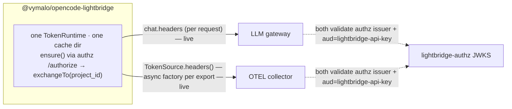

# ADR-0012 — One credential across the gateway and OTEL: the `@vymalo/opencode-lightbridge` umbrella plugin

- **Status**: Proposed
- **Date**: 2026-08-23
- **Applies to**: a new `@vymalo/opencode-lightbridge` plugin composing the gateway-auth (`oauth2`/`repo-auth`) and `otel` concerns over one shared credential. **MCP is out of scope** (see Context).

## Context

Today a developer running OpenCode against the Lightbridge stack holds **separate credentials in separate stores** for what is one identity:

- **Gateway** — `@vymalo/opencode-oauth2` (a token fused into its per-server sync-state file) and/or `@vymalo/opencode-repo-auth` (a human root token in `opencode-repo-auth/human.json` plus per-project exchange files, ADR-0011). Both inject via the per-request `chat.headers` hook.
- **OTEL** — `@vymalo/opencode-otel` gets its bearer from a **static header** or an **external `tokenCommand`** (credential helper, stdout = token), cached in-memory only. It does **not** use `auth-core`.

They need not be separate: the LLM gateway and the governance OTEL collector **both validate the same `lightbridge-authz` issuer + `aud=lightbridge-api-key`**, so **one token is accepted at both**. The blocker is plumbing, not cryptography.

`@vymalo/opencode-auth-core` already provides the primitive: `TokenRuntime` (`ensure`/`refresh`/`exchangeTo(key, subjectToken, extraParams)`, ADR-0011) over a `FileCacheStore`. What is missing is one plugin that owns **one** `TokenRuntime` and drives both egresses from it — the maintainer's goal of **one credential obtained once ("one `auth.json`"), reused everywhere.**

**MCP is deliberately excluded.** OpenCode mints its own per-server MCP OAuth token into `~/.local/share/opencode/mcp-auth.json`, and `McpRemoteConfig.headers` is a static map with no per-request hook — sharing our credential there would require a stdio credential-proxy sidecar. That complexity is not worth it for the current goal; MCP keeps using OpenCode's native OAuth.

## Decision

Ship **`@vymalo/opencode-lightbridge`**: one plugin with per-concern option blocks (`auth`, `gateway`, `otel`), built on **one shared `TokenRuntime` writing to a single cache dir** (`<cacheRoot>/opencode-lightbridge/`). That store is the single credential.

- **Login once, against `lightbridge-authz`.** `ensure()` runs `authorization_code` (PKCE, local callback) — or `device_code` for headless — against authz's **`/authorize`** endpoint (being added now), so the plugin authenticates directly to authz; whether authz federates behind it is invisible to the plugin. The result is the human root token (with `offline_access` for silent refresh).
- **Working token per ADR-0011.** The gateway credential is the project-scoped token from `exchangeTo(projectId, humanRoot, { project_id })` (`projectId` declared in `opencode.json`), short-lived, re-exchanged from the root on expiry.
- **Two injectors bind to the one runtime:**
  - **Gateway** — the `chat.headers` hook calls `exchangeTo(...)`/`ensure()` and sets `Authorization` per request. Refresh is free because it runs per request.
  - **OTEL** — replace otel's external `tokenCommand` with an **in-process `TokenSource`** whose `headers()` calls the shared runtime. otel's OTLP exporter already invokes `headers()` as an **async factory before every export** (ADR-0009), so this is **refresh-aware with no new machinery** — the seam already exists.
- **Extract a shared `@vymalo/opencode-core-otel` package** (mirroring `auth-core`): the OTel SDK setup, exporters, recorder/propagation, and the **`TokenSource` seam**. Both `@vymalo/opencode-otel` (standalone — its own static/`tokenCommand` source) and `@vymalo/opencode-lightbridge` (umbrella — a source backed by the shared `TokenRuntime`) depend on it. The umbrella **composes** `auth-core` + `core-otel` + a thin gateway injector; it forks no engine logic.

## Consequences

**Buys us:**

- One login (now against authz directly, via `/authorize`), one store, one refresh loop — every egress rides the same token.
- Both egresses get live refresh for free: the gateway via the per-request `chat.headers` hook, OTEL via its per-export async `headers()` factory. No timers, no staleness, no sidecar.
- Security-critical token code stays in `auth-core` (ADR-0011); the umbrella adds only two thin injectors.
- With authz owning `/authorize`, the plugin no longer logs in against Keycloak — the "no Keycloak at the client" goal is met once `/authorize` lands.

**Costs us:**

- Two shared cores to maintain — `auth-core` (token lifecycle) and the **new `core-otel`** (OTEL engine). The umbrella **composes** both plus a thin gateway injector; `opencode-otel` is refactored onto `core-otel` (backward-compatible, keeping its static/`tokenCommand` source). The upside is no forked engine logic; the cost is one more shared package and the extraction work.
- Depends on authz's `/authorize` (in progress). Until it ships, `ensure()` falls back to the current IdP; the wiring here is unchanged either way.

## Alternatives considered

| Alternative | Why rejected |
| --- | --- |
| **Keep separate plugins, share only the `auth-core` library** | auth-core is a primitive, not a store — each plugin keeps its own namespace and otel sits outside it entirely. Only one owned `TokenRuntime` yields *one* credential. |
| **Include an MCP module** | `McpRemoteConfig.headers` is static with no per-request hook, so sharing our token there needs a stdio credential-proxy sidecar. Out of scope; MCP keeps OpenCode's native per-server OAuth (`mcp-auth.json`). |
| **Inject OTEL headers via env `OTEL_EXPORTER_OTLP_HEADERS`** | Static and not refresh-aware; otel's async `headers()` factory (ADR-0009) is the live seam. |
| **Store the credential in OpenCode's own `auth.json` via the `auth` hook** | Per-provider and host-shaped; the plugin's single `auth-core` cache dir is simpler and already the house pattern. Revisit only if host-native storage becomes a requirement. |

## Related

- [ADR-0011](0011-repo-auth-project-id-token-exchange.md) — the `project_id` exchange + `TokenRuntime.exchangeTo` this reuses.
- [ADR-0009](0009-otel-otlp-http-not-grpc.md) — the OTLP exporter whose async `headers()` factory is the OTEL injection seam.
- `@vymalo/opencode-auth-core` `TokenRuntime` (PR #97); `@vymalo/opencode-core-otel` (to be extracted from `opencode-otel`) — the shared OTEL engine both the standalone plugin and the umbrella build on; `lightbridge-authz` `/authorize` (being added) as the login endpoint.
