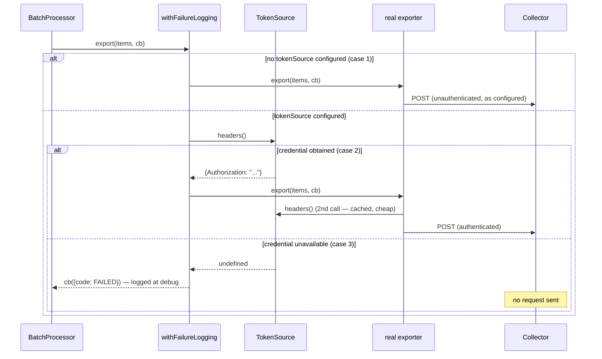
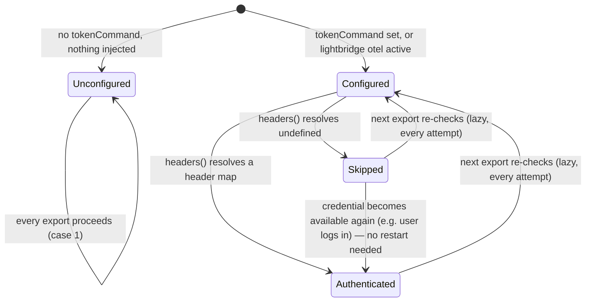

# ADR-0015 — OTEL export fails closed on the credential, not just the header

- **Status:** Accepted
- **Date:** 2026-09-04
- **Applies to:** `@vymalo/opencode-core-otel`'s `TokenSource` contract (`src/token-source.ts`),
  the export gate in `withFailureLogging` (`src/export-logging.ts`), its wiring in `createProviders`
  (`src/providers.ts`), and `@vymalo/opencode-lightbridge`'s `createRuntimeTokenSource`
  (`packages/opencode-lightbridge/src/opencode.ts`).

## Context

`createRuntimeTokenSource` in `opencode-lightbridge` carried a comment claiming its `headers()`
method was "fail closed, same posture as the gateway header." It was not. On any exchange failure —
expired login, rejected exchange, no session — it caught the error and returned `{}`:

```ts
headers: async () => {
  try {
    const token = await runtime.getProjectToken({ interactive: false });
    return { Authorization: `${token.tokenType || "Bearer"} ${token.accessToken}` };
  } catch {
    return {};
  }
}
```

`{}` is a **header map with zero entries**, not "no export." `createProviders` builds every OTLP
exporter with `headers: async () => ({ ...config.headers, ...(await tokenSource.headers()) })`
(`providers.ts`), and the OTel SDK's `HeadersFactory` contract (`() => Promise<Record<string,
string>>`) has no way to signal "don't send this one" — whatever the factory resolves to, the
exporter sends the request. So an empty object did not stop the export; it stripped the
`Authorization` header and let the request go out anyway. The gateway's own `chat.headers` injector
(`createGatewayChatHeaders`) really does fail closed — no header is a request the gateway itself
403s inline — but the OTEL exporter has no equivalent per-request rejection path of its own. The
practical result: a logged-out developer's session ships an unauthenticated OTLP POST on every batch
flush (every 5s for traces/logs, 60s for metrics), the collector rejects each one (401/403), and
`withFailureLogging` logs `otel_export_failed` for every rejection — noise for the developer (who
cannot act on it mid-turn, per [ADR-0014](0014-suite-wide-no-terminal-mirror.md)) and unauthenticated
traffic for the collector operator, indefinitely, for as long as the session runs logged out.

`@vymalo/opencode-core-otel` is shared: the standalone `@vymalo/opencode-otel` plugin builds its own
`TokenSource` from `config.tokenCommand` in the exact same `createProviders` path
(`createTokenSource`, ADR-0012), and a plugin with **no** `tokenCommand` and **no** injected source
exports to a plain, unauthenticated collector by design — that is a legitimate, common configuration
(see the Quick start in [`otel.md`](../otel.md)) and must keep working exactly as it does today. Any
fix here has to distinguish three states, not two:

1. **No token source configured at all** — no `tokenCommand`, nothing injected. Export proceeds
   unauthenticated, as always.
2. **Token source configured, credential obtained** — export proceeds with the resolved header.
3. **Token source configured, credential unavailable** — the state the buggy comment thought it was
   already handling. The export must not happen at all.

The existing `TokenSource.headers(): Promise<Record<string, string>>` contract cannot express case 3
without colliding with a legitimate "no extra headers" answer in case 2 — which is exactly how the
bug happened in the first place.

## Decision

**`TokenSource.headers()` now returns `Promise<Record<string, string> | undefined>`.** `undefined`
means "no credential is available right now, do not export"; a (possibly empty) object means "the
export may proceed, use these as the extra headers." `createTokenSource` (the standalone plugin's
`tokenCommand` helper) and `createRuntimeTokenSource` (the lightbridge umbrella) both now return
`undefined` from their failure branches instead of `{}`.

**The actual gate lives in `withFailureLogging`, not in the exporter's own `headers` factory** —
because by the time an OTLP exporter's internal `HeadersFactory` runs, it is already committed to
sending the request; there is no way to cancel from inside it. `withFailureLogging` accepts an
optional `tokenSource`, and when one is present it resolves `headers()` **before** delegating to the
real `exporter.export()`:





Design choices inside the gate:

- **Gate only the network-facing exporter kind.** `console` exporters never leave the process, so
  `createProviders` only passes `tokenSource` through to `observe()` for the `otlp` exporter kind —
  gating `console` output on an unrelated collector credential would blank local debug output for no
  security benefit.
- **A skip is `debug`, not `warn`, and does not count toward `consecutiveFailures`.** It is a policy
  decision ("we chose not to call the network"), not an export failure ("we called it and it was
  rejected") — conflating the two would both misrepresent the event and spam the failure-recovery
  counter that `otel_export_recovered` depends on.
- **No new retry machinery.** The skip decision is re-evaluated on every export attempt, at the batch
  processor's own existing cadence (5s for traces/logs, 60s for metrics) — there is no additional
  timer, backoff, or poll loop. This is deliberately **lazy**, not a one-time check at plugin
  startup: a user who logs in mid-session needs telemetry to resume on the very next flush, and a
  startup-only check would leave it dead for the rest of the process.
- **The double `headers()` call is intentional and cheap, not a second resolution attempt.** When the
  gate's call resolves a credential, `exporter.export()` proceeds and the exporter's own internal
  `HeadersFactory` (built in `otlpArgs`) calls `tokenSource.headers()` again to fetch the value for
  the actual request. Both `createTokenSource` and `createRuntimeTokenSource`/`LightbridgeRuntime`
  already cache a valid credential in memory, so this second call is a cache hit, not a second
  network/process round-trip. Critically, this only happens on the *success* path — when the gate's
  call resolves `undefined`, `exporter.export()` is never called, so the exporter's own factory never
  runs and there is no second *failed* attempt either. Net token-endpoint traffic is unchanged from
  before this ADR; the difference is entirely on the collector side, which now sees zero
  unauthenticated requests instead of one per flush.

**`headers(): Promise<... | undefined>` over a separate `hasCredential()` method.** Both were
considered (see Alternatives); `headers()` returning `undefined` was chosen because callers already
call `headers()` to get the value — a separate check-then-fetch method would either duplicate the
resolution work or open a window where `hasCredential()` says yes and the immediately-following
`headers()` call then fails anyway (e.g. the cached token ages out between the two calls). Folding
the signal into the one call that already exists keeps the check atomic.

**`opencode-lightbridge`'s `otel.tokenCommand`/`tokenHeader`/`tokenPrefix` are now diagnosed, not
silently swallowed.** They were already dead configuration before this ADR — the injected
runtime-backed `TokenSource` unconditionally wins over `config.tokenCommand` in `createProviders`
(ADR-0012) — but setting them produced no signal at all. `createLightbridgePlugin` now logs
`lightbridge_otel_token_command_ignored` once, at `debug`, when any of the three (or their `OTEL_*`
env equivalents) are set on an active `otel` block. `debug`, not `warn`, because — like every other
diagnostic in this suite (ADR-0014) — this must not interrupt the terminal, and this is an
informational no-op rather than something that broke. The config schema itself is unchanged: `otel`
still accepts the full `OtelPluginOptions` shape (rejecting the fields outright would be a breaking
schema change, out of scope here).

## Consequences

**Positive**

- **The bug is actually fixed.** A logged-out `opencode-lightbridge` session (or a standalone-otel
  session whose `tokenCommand` helper has failed) stops sending unauthenticated OTLP requests to the
  collector entirely, rather than sending them with a stripped header for the collector to reject.
- **The standalone plugin's unauthenticated-by-design configuration is untouched.** No `tokenSource`
  at all means the gate never engages — case 1 is not merely preserved by accident, it is structurally
  the same code path as before this change (`withFailureLogging` with no `tokenSource` option).
- **Telemetry self-heals on login with no code path added for it.** Because the check is lazy and
  re-run every export, "resume after a later successful login" falls out of the existing design
  rather than needing its own mechanism.
- **The contract is reusable.** Any future `TokenSource` implementation (a different credential
  helper, a different umbrella plugin) gets the same fail-closed behavior for free by returning
  `undefined` on failure — nothing else needs to know about the gate.

**Negative / cost**

- **`TokenSource.headers()` is a breaking signature change** for any external embedder building a
  custom `TokenSource` — `Record<string, string>` is no longer literally correct as the return type;
  `Record<string, string> | undefined` is. Internal call sites are all updated in this same change;
  an external consumer would need to update their `catch` branches from `return {}` to `return
  undefined`.
- **One additional (cheap) `await` per export attempt** when a `tokenSource` is configured — the gate
  check itself. See the double-call note above for why this does not translate into extra network or
  subprocess cost in the common case.
- **A skip result reports `ExportResultCode.FAILED` to the batch processor**, same as a genuine
  network failure would, so from the processor's perspective a skipped batch and a rejected batch
  look identical (both are simply dropped — neither processor retries on its own). The distinction
  is preserved in the log stream (`otel_export_skipped_no_credential` at `debug` vs
  `otel_export_failed` at `warn`), not in the `ExportResult` itself.

## Alternatives considered

| Alternative | Why rejected |
| --- | --- |
| **A separate `hasCredential(): Promise<boolean>` method on `TokenSource`** | Duplicates the resolution `headers()` already performs, or risks a check-then-fetch race where the answer changes between the two calls (e.g. a cached token ages out in between). `headers()` returning `undefined` keeps the signal atomic with the one call every implementation already makes. |
| **Keep `headers()` returning `{}` and instead check `Object.keys(headers).length === 0` in the gate** | Reintroduces exactly the ambiguity this ADR exists to remove: a `TokenSource` with genuinely no extra headers to add (a legitimate answer once the network posture allows it) would be indistinguishable from a failed credential. `undefined` is not ambiguous with `{}`. |
| **Cancel the export from inside the exporter's own `HeadersFactory`** | Not possible with the OTel SDK's exporter contract: `HeadersFactory` resolves to the header map that gets attached to a request the exporter has already decided to send. There is no return value that means "don't send this." The gate has to sit one level up, before `exporter.export()` is even called — which is exactly where `withFailureLogging` already lives. |
| **A startup-time (not lazy) credential check** | Would leave telemetry dead for the rest of a long-running session after one failure, even once the user logs back in — directly contradicting the requirement that a later successful login resumes exporting. Lazy (re-checked every export attempt, at the existing batch cadence) costs nothing extra and self-heals. |
| **Throw / hard-fail `parseLightbridgeOptions` when `otel.tokenCommand` etc. are set under `opencode-lightbridge`** | Out of scope for this change (making the schema stricter is a separate, deliberate decision) and would break an existing config that happens to carry these fields for other reasons (e.g. copy-pasted from a standalone `otel` block) rather than degrading gracefully. A `debug`-level diagnostic communicates the same fact without a breaking schema change. |
| **Backoff/cooldown on the token resolution itself, independent of the batch interval** | Would add new timer state to every `TokenSource` implementation for a problem the existing batch-processor cadence already bounds — see the "double `headers()` call is intentional and cheap" analysis above for why no extra network pressure is actually introduced. |

## Related

- [ADR-0012](0012-single-auth-across-gateway-and-otel.md) — the shared `TokenRuntime` /
  runtime-backed `TokenSource` this ADR's gate protects.
- [ADR-0009](0009-otel-otlp-http-not-grpc.md) — the OTLP/HTTP exporter whose `HeadersFactory`
  contract has no way to cancel a send from inside itself, which is why the gate sits in
  `withFailureLogging` rather than in the headers factory.
- [ADR-0014](0014-suite-wide-no-terminal-mirror.md) — why the skip is logged at `debug`, not printed
  to the terminal.
- [`otel.md` → Fail-closed export](../otel.md#fail-closed-export) and
  [`lightbridge.md`](../lightbridge.md) — the user-facing description of the three cases.
