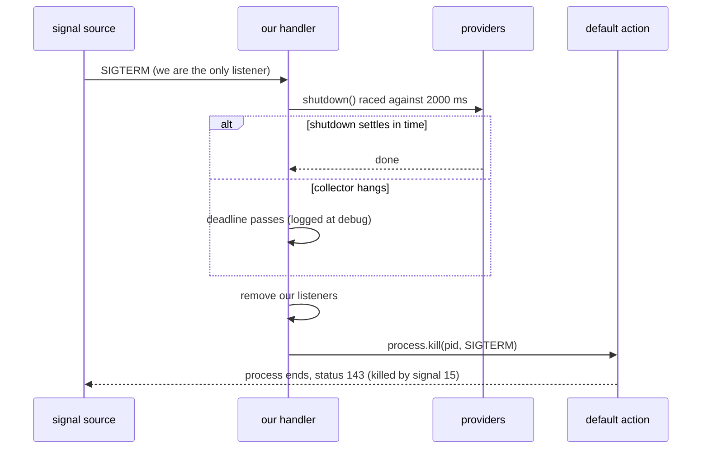
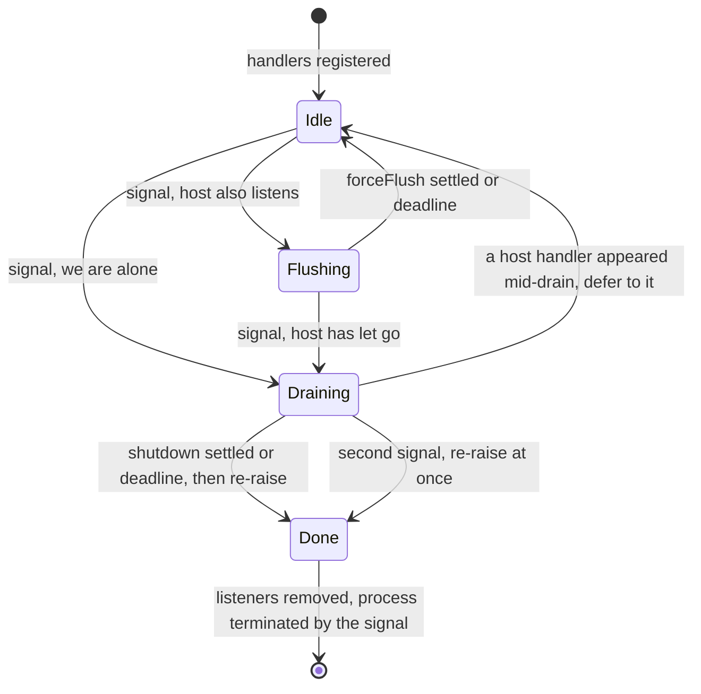

# ADR-0018 — Exit handlers re-raise the signal: a listener that only flushes keeps the process alive

- **Status:** Accepted
- **Date:** 2026-10-07
- **Applies to:** `@vymalo/opencode-core-otel` (`src/exit-handlers.ts`, exported through `./lib`),
  which both `@vymalo/opencode-otel` (`src/opencode.ts`) and `@vymalo/opencode-lightbridge`
  (`src/opencode.ts`) now call instead of each carrying a private copy.

## Context

Both OTel plugins registered the same drain on process exit, because the plugin API has no dispose
hook that runs when the process is signalled and a short CLI invocation would otherwise lose
whatever is still in a batch processor:

```ts
process.once("beforeExit", drain);
process.once("SIGINT", drain);
process.once("SIGTERM", drain);   // drain = abandon deferred attributes, void providers.shutdown()
```

The drain was correct. The registration was not, because of a runtime rule nobody was thinking
about: **installing a listener for SIGINT or SIGTERM replaces the runtime's default action, which is
"terminate".** A listener that flushes and then returns leaves the process running — it has
swallowed the signal.

Measured on `opencode serve` (opencode 1.18.33, a Bun-compiled binary) with our plugins loaded:

| Run | Result |
| --- | --- |
| `opencode serve`, plugins loaded, SIGTERM, 5 s grace | **Still alive in 15 of 15 scripted runs**; every one needed SIGKILL |
| `opencode serve --pure` (no plugins), SIGTERM | Exits in ~0.1 s |
| A plugin whose only act is `process.once("SIGTERM", …)` | Keeps `serve` alive — the listener alone is enough, no telemetry involved |

So the bug is not in the OTel work (exporters, deadlines, collectors) — it is the bare act of
registering the listener and then not giving the default action back. `serve` has no signal handler
of its own, so ours was the only one, and the process became unkillable by anything short of
SIGKILL.

Two further facts shape the fix:

- **The host sometimes does listen.** `opencode run`'s interactive footer registers its own SIGINT
  listener (`packages/opencode/src/cli/cmd/run/runtime.lifecycle.ts`, `process.on("SIGINT", …)` →
  `footer.requestExit()`, plus a temporary "ignore" handler while an editor is open). Where the
  host owns a signal, receiving it does **not** mean the process is ending — in the editor case the
  host is deliberately swallowing it. `serve` and the launcher's forwarded SIGTERM have no host
  handler. So "another listener exists" is a real branch, and a handler that terminated the process
  there would kill a session the host chose to keep.
- **A plugin is instantiated more than once per process.** OpenCode builds one instance per project
  directory, and each instance runs the plugin factory again. Observed on a real `serve` that was
  asked about two directories: `lightbridge_otel_enabled` logged twice, so two registrations of the
  same handlers on one `process`. Each registration sees the other's listeners on the signal.

The plugin `dispose` hook is not a substitute: it belongs to instance teardown and does not run on
a default SIGTERM, which is precisely the case that was broken.

## Decision

**One implementation, in `@vymalo/opencode-core-otel`: `registerExitHandlers(providers, logger,
deferred, { eventPrefix, deadlineMs?, host?, timers? })`.** Both plugins call it. The old private
functions are deleted. The `registerProcessHandlers` factory option each plugin already had still
skips registration (tests). `eventPrefix` keeps each plugin's own event names
(`otel_shutdown_failed`, `lightbridge_otel_shutdown_failed`, …).

What it does depends on who owns the signal **when the signal arrives**:

| Situation | Action | Kills? |
| --- | --- | --- |
| `beforeExit` | Abandon deferred attributes, `providers.shutdown()` once. The loop is already ending. | never |
| SIGINT/SIGTERM, **no other listener** | `providers.shutdown()` **bounded** (default 2000 ms), remove our listeners, **re-raise the same signal** with `process.kill(process.pid, signal)` so the default action ends the process with the right status. | yes |
| SIGINT/SIGTERM, **another listener exists** (host owns it) | **Do not shut down.** Bounded `providers.forceFlush()`, providers stay alive, **our listener stays registered**. One flush per burst of signals. | never |
| Second signal while a shutdown-and-reraise is draining | Stop waiting; re-raise immediately — the user is insisting. (If a host handler has appeared by then, leave it to the host.) | yes |
| Host listener removed later, then another signal | Takes the shutdown-and-reraise path (the situation is "no other listener" again). | yes |





**Several registrations form one group.** Every listener we install carries a shared marker
(`Symbol.for("@vymalo/opencode-core-otel/exit-handler")`). "Another listener" means a listener
**without** the marker, so two instances of this plugin — or `opencode-otel` beside
`opencode-lightbridge`, or two installed versions of core-otel — never mistake each other for the
host. The group exits together: the last registration to finish re-raises, and it removes its
siblings' listeners first; a repeated signal ends the whole group at once. Without this, the
two-directory case above would leave each registration deferring to the other and nobody would hand
the default action back.

**The process surface and the timer are injected** (`host`: `on`/`once`/`removeListener`/
`listeners`/`kill`/`pid`; `timers`: `set`/`clear`), defaulting to the real `process` and
`setTimeout`. Tests drive an `EventEmitter` stand-in and manual timers and so never signal, or kill,
the test runner.

Nothing writes to the terminal (ADR-0014). Outcomes are `debug` events —
`<prefix>_exit_reraised`, `<prefix>_exit_deferred_to_host`, `<prefix>_shutdown_deadline_exceeded`,
`<prefix>_flush_deadline_exceeded` — plus `warn` for `<prefix>_shutdown_failed`,
`<prefix>_flush_failed` and `<prefix>_exit_reraise_failed`. Because the process is about to die,
the `debug` records are best-effort; the observable result is the exit status.

### Verification (real host)

`opencode serve` 1.18.33, hermetic sandbox (own `HOME` and `XDG_*`), plugin loaded by absolute path
with the otel module active (`lightbridge_otel_enabled` in the log), SIGTERM sent to that one PID,
5 s grace:

| Plugin | Signal | Result |
| --- | --- | --- |
| none (`--pure`) | SIGTERM | exited in 0.06 s, status 143 |
| published 0.17.0 (this ADR's bug) | SIGTERM ×3, SIGINT ×1 | **alive after 5 s every time**, SIGKILL needed |
| published 0.17.0, two instances | SIGTERM | alive after 5 s, SIGKILL needed |
| this change | SIGTERM ×3 | exited in 0.06 s, status 143 (killed by signal 15) |
| this change | SIGINT ×1 | exited in 0.06 s, status 130 (killed by signal 2) |
| this change, two instances | SIGTERM, SIGINT | exited in 0.06 s, status 143 / 130 |

The exit is as prompt as with no plugin at all and carries the correct signal status. Not verified
on a real host: the TUI worker path, and the host-owned branch of `opencode run` (both covered by
the injected-process unit tests only).

## Consequences

**Positive**

- `opencode serve` and any other host with no signal handler of its own terminates on SIGTERM and
  SIGINT again, in step with a plugin-less run, with the conventional `128 + n` status.
- The last batch is still flushed on a signal — the reason the listener existed — now bounded, so a
  hung collector can delay exit by at most the deadline rather than forever.
- A host that owns a signal keeps owning it: we flush and stay out of its way, and the providers
  remain usable if the host decides not to exit.
- One implementation instead of two copies of the same function, whose comments already pointed at
  each other. A change to exit behaviour is now made, and tested, once.

**Negative / cost**

- Exit on a signal can take up to `deadlineMs` (2 s) longer when the collector is unreachable. That
  is the price of attempting the final flush at all, and it is bounded.
- The host-owned branch only flushes: telemetry still buffered after the flush, or produced
  afterwards, is lost if the host then exits through its own path without a `beforeExit`. Better
  than shutting providers down under a process the host intends to keep alive.
- "Another listener exists" is a point-in-time check — made when the signal arrives and again when a
  drain completes. A host handler that is installed and removed between the two is invisible to it.
- On Windows, Node documents `process.kill` with `SIGINT`/`SIGTERM` as killing the process forcefully
  and abruptly, so the exit status will not carry the signal. The process still ends, which is the
  point.
- The shared marker is a cross-version contract (`Symbol.for(...)` with `pending`/`stop`); a future
  change to it must stay readable by older copies, or be versioned in the symbol key.

## Alternatives considered

| Alternative | Why rejected |
| --- | --- |
| **`process.exit(0)` after the drain** | Wrong status: a SIGTERM'd process should report termination by that signal (143), not success, or supervisors and scripts misread it. It also cuts the host and every other plugin's handlers short — including the `opencode run` case where the host deliberately ignores SIGINT. |
| **Always re-raise, ignoring other listeners** | Kills a session the host chose to keep (editor open in `opencode run`). The host's handler, not ours, decides whether a signal ends the process. |
| **The plugin `dispose` hook** | It is wired to instance teardown, not to the process being signalled — it does not run on a default SIGTERM, the exact case that was broken. |
| **No signal handler at all** | Fixes the hang by construction, but loses the last batch of spans and logs on every Ctrl-C and `kill` — the reason the handler was added. |
| **Keep two private copies, patch both** | The group coordination needs every registration to share one marker and one protocol; two copies would agree on it only by convention, and the next fix would have to be made twice. |
| **No group marker (each registration checks only `listenerCount`)** | With two registrations each sees the other and concludes the host owns the signal, so nobody re-raises — measured on a two-directory `serve`, this is a realistic setup. |
| **Handler returns silently when it cannot drain in time** | Same bug as before with a timeout in front of it: the process stays alive. The deadline exists to bound the wait, not to abandon the exit. |

## Related

- [ADR-0014](0014-suite-wide-no-terminal-mirror.md) — why the outcomes are `debug` events and the
  plugins print nothing.
- [ADR-0015](0015-otel-fail-closed-credential-gate.md) — the credential gate that makes a logged-out
  shutdown cheap: exports are skipped before the network, so the final flush has nothing to wait on.
- [`otel.md` → Flushing](../otel.md#flushing) and
  [`architecture.md` → Flushing without a dispose hook](../architecture.md#flushing-without-a-dispose-hook)
  — the user-facing description.
