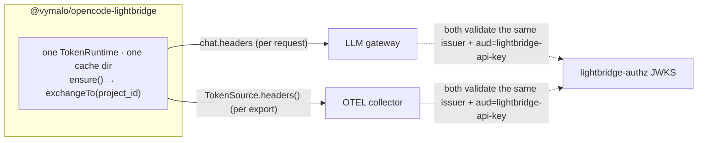

# `@vymalo/opencode-lightbridge` — one credential, every egress

Status: **implemented** — see [ADR-0012](adr/0012-single-auth-across-gateway-and-otel.md) (Accepted)
and `packages/opencode-lightbridge/`.

The umbrella plugin: **one shared `TokenRuntime`** drives **both** the LLM gateway bearer and the
OTEL export credential, because both validate the same `lightbridge-authz` issuer +
`aud=lightbridge-api-key`. A developer authenticates once as themselves; every egress that needs a
project-scoped credential rides that same token.

## Why this exists

Running `@vymalo/opencode-repo-auth` and `@vymalo/opencode-otel` side by side works, but each holds
its **own** credential in its **own** cache namespace — two logins, two token stores, no relationship
between the two even though the gateway and the governance OTEL collector accept the exact same
token. `@vymalo/opencode-lightbridge` closes that gap by composing `@vymalo/opencode-auth-core` (the
OAuth / RFC 8693 token-exchange primitive) and `@vymalo/opencode-core-otel` (the OTel engine — both
`@vymalo/opencode-otel` and this package build on it) over **one** `TokenRuntime`. No engine logic is
forked; this package is a thin composition layer plus two small injectors.

## The one-credential design



1. **Login once** — `ensure()` runs the configured OAuth flow (`authorization_code` with PKCE, or
   `device_code` for headless) against `auth.issuer`, producing the human root token
   (`offline_access` scope → silent refresh via its refresh token).
2. **Exchange once per project** — `exchangeTo(projectKey, humanToken, projectId ? { project_id } : {})`,
   an RFC 8693 token exchange presenting `project_id` as a form param when configured (no `audience`,
   no mint step — same contract as `@vymalo/opencode-repo-auth`, see [ADR-0011](adr/0011-repo-auth-project-id-token-exchange.md)).
   **`projectId` is fully optional**: omit it and the exchange sends no `project_id`, so the backend
   mints a token for the caller's **default project**. The result is short-lived and carries no
   refresh token; renewal is always a fresh exchange from the human root ("model b").
3. **Two injectors read the SAME cached project token:**
   - **Gateway** (`gateway` config block) — a `chat.headers` hook injects
     `Authorization: Bearer <project-token>` on the configured `providers`, per request. Fails
     closed: an exchange failure injects no header, and the gateway 401s.
   - **OTEL** (`otel` config block) — a `TokenSource` whose `headers()` calls the shared runtime,
     passed as the 5th argument to `@vymalo/opencode-core-otel`'s `createProviders`. The OTLP
     exporters already call `headers()` as an async factory before every export (see
     [ADR-0009](adr/0009-otel-otlp-http-not-grpc.md)), so this is refresh-aware with no new
     machinery — the seam already existed, this just points it at the shared runtime instead of a
     standalone credential helper (`tokenCommand`). `invalidate()` is a documented no-op in v1: the
     project token is short-lived and `getProjectToken` re-checks its own expiry on every call, so
     there is no stale in-memory copy to drop.

Both modules are independent opt-ins. `auth` alone (no `gateway`, no `otel`) is a valid, inert
config — the plugin logs once and registers no observing hooks.

## Configuration

```jsonc
// opencode.json
{
  "plugin": [
    ["@vymalo/opencode-lightbridge", {
      "auth": {
        "id": "lightbridge",
        "issuer": "https://authz.example.com/realms/lightbridge",
        "clientId": "opencode-cli",
        "scopes": ["openid", "offline_access"],
        "authFlow": "device_code"
      },
      "gateway": {
        "projectId": "proj-123",
        "providers": ["gateway"]
      },
      "otel": {
        "endpoint": "http://localhost:4318"
      }
    }]
  ]
}
```

| Field | Required | Notes |
| --- | --- | --- |
| `auth` | yes | `AuthServerConfigInput` (auth-core) — the one IdP login. Validated eagerly via `validateAuthConfig`; a malformed block fails plugin load with a field-level error rather than a half-built plugin. |
| `gateway.providers` | required if `gateway` is set | Which OpenCode provider ids get the project bearer injected on `chat.headers`. |
| `gateway.projectId` | no | Optional project id for the gateway exchange. Omit for the caller's **default project**. |
| `otel` | no | Same shape as `@vymalo/opencode-otel`'s options, **minus** `tokenCommand` / `tokenHeader` / `tokenPrefix` — the shared runtime supersedes that seam entirely. |
| `projectId` (top-level) | no | Optional project id for the shared exchange. When omitted (and no `gateway.projectId`), the backend mints a **default-project** token. An explicit top-level `projectId` wins over `gateway.projectId`. |

If a module needs a project token and none is resolvable, the plugin logs
`lightbridge_missing_project_id` (warn) and that module's credential injection stays inert — `gateway`
registers no `chat.headers` hook at all; `otel` still activates (telemetry is still useful) but its
`TokenSource` is `undefined`, so exports carry no `Authorization` header unless `otel.headers` supplies
one directly.

## Scope: gateway + OTEL, not MCP

MCP is deliberately excluded. OpenCode mints its own per-server MCP OAuth token into
`mcp-auth.json`, and `McpRemoteConfig.headers` is a static map with no per-request hook — sharing this
plugin's credential there would need a stdio credential-proxy sidecar, which is not worth the added
complexity today. MCP keeps using OpenCode's native per-server OAuth. See
[ADR-0012 → Alternatives considered](adr/0012-single-auth-across-gateway-and-otel.md#alternatives-considered).

## Relationship to the standalone plugins

`@vymalo/opencode-lightbridge` does not replace `@vymalo/opencode-repo-auth` or
`@vymalo/opencode-otel` — it is an alternative for the case where you want **one** login instead of
two. Run the standalone plugins when you only need one egress, or when the gateway and OTEL collector
sit behind genuinely different IdPs. Run `opencode-lightbridge` when both accept the same
`lightbridge-authz`-issued token and you want a single credential store.

| | Standalone (`repo-auth` + `otel`) | `opencode-lightbridge` |
| --- | --- | --- |
| Logins | 2 (separate `TokenRuntime`s, separate cache dirs) | 1 |
| Cache namespace | `opencode-repo-auth/` + otel's `tokenCommand` (external, not auth-core) | `opencode-lightbridge/` |
| OTEL credential | static header or external `tokenCommand` helper | the same project-scoped token as the gateway |
| Config | two separate `plugin` entries | one `plugin` entry, two option blocks |

## Package layout

Mirrors the per-package convention (see `AGENTS.md`), **minus `cache.ts`** (auth-core's
`FileCacheStore`, reached through `TokenRuntime`, owns persistence):

```
packages/opencode-lightbridge/
├── src/
│   ├── index.ts    # slim entry — single `export { default } from "./opencode.js"`
│   ├── opencode.ts # plugin factory: createLightbridgePlugin(opts) → Plugin; merges gateway + otel hooks
│   ├── plugin.ts   # LightbridgeRuntime — the ONE shared TokenRuntime wrapper (ensure/exchange/cache)
│   ├── config.ts   # pluginOptions parsing + validation → LightbridgeOptions
│   └── lib.ts       # public API (embedders)
└── test/           # vitest, *.test.ts
```

## Security posture

Same posture as `@vymalo/opencode-repo-auth`, extended to the OTEL egress:

- **Fail closed** — an exchange failure means no gateway header and no OTEL `Authorization` header;
  neither module ever invents a token.
- **Own cache namespace** — `<cacheRoot>/opencode-lightbridge/`, separate from oauth2/repo-auth/otel.
- **Redaction** — auth-core's logger redacts `token|secret|password` fields.
- **Disk** — `0o600` files, atomic rename (auth-core `FileCacheStore`, [ADR-0005](adr/0005-atomic-file-writes-per-writer-temp.md)).
- **No content capture** — the OTEL half inherits `@vymalo/opencode-core-otel`'s privacy posture
  (no prompts/responses/tool arguments in telemetry; see [`otel.md` → Privacy](otel.md)).

## Related

- [ADR-0012](adr/0012-single-auth-across-gateway-and-otel.md) — the design decision and alternatives considered.
- [`repo-auth.md`](repo-auth.md) — the project-token exchange contract this package reuses verbatim.
- [`otel.md`](otel.md) — the OTEL config surface (`endpoint`, `exporters`, `serviceName`, …) this package reuses via `@vymalo/opencode-core-otel`.
