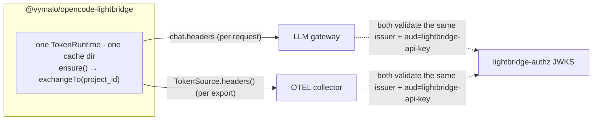

# `@vymalo/opencode-lightbridge` — the all-in-one plugin

Status: **implemented** — see [ADR-0012](adr/0012-single-auth-across-gateway-and-otel.md) (Accepted)
and [ADR-0017](adr/0017-lightbridge-all-in-one.md) (Accepted, amends ADR-0012), plus
`packages/opencode-lightbridge/`.

The umbrella plugin: **one shared credential** drives every egress a project needs — provider
registration + model discovery (`register`, ADR-0017 — "everything `@vymalo/opencode-oauth2` does"),
the LLM gateway bearer (`gateway`), and the OTEL export credential (`otel`). A developer
authenticates once as themselves; every module that needs a credential rides that same login. Since
ADR-0017, that login is ALSO shared with `@vymalo/opencode-oauth2` when both are configured against
the same IdP — see [One login, shared cache with oauth2](#one-login-shared-cache-with-oauth2-adr-0017)
below.

## Why this exists

Running `@vymalo/opencode-repo-auth` and `@vymalo/opencode-otel` side by side works, but each holds
its **own** credential in its **own** cache namespace — two logins, two token stores, no relationship
between the two even though the gateway and the governance OTEL collector accept the exact same
token. `@vymalo/opencode-lightbridge` closes that gap by composing `@vymalo/opencode-auth-core` (the
OAuth / RFC 8693 token-exchange primitive) and `@vymalo/opencode-core-otel` (the OTel engine — both
`@vymalo/opencode-otel` and this package build on it) over **one** `TokenRuntime`. No engine logic is
forked; this package is a thin composition layer plus two small injectors.

## The one-credential design



1. **Login once** — `ensure()` runs the configured OAuth flow (`authorization_code` with PKCE, or
   `device_code` for headless) against `auth.issuer`, producing the human root token
   (`offline_access` scope → silent refresh via its refresh token).
2. **Exchange once per project — OPT-IN since ADR-0017 (`gateway.exchange: true`).**
   `exchangeTo(projectKey, humanToken, projectId ? { project_id } : {})`, an RFC 8693 token exchange
   presenting `project_id` as a form param when configured (no `audience`, no mint step — same
   contract as `@vymalo/opencode-repo-auth`, see [ADR-0011](adr/0011-repo-auth-project-id-token-exchange.md)).
   **`projectId` is fully optional**: omit it and the exchange sends no `project_id`, so the backend
   mints a token for the caller's **default project**. The result is short-lived and carries no
   refresh token; renewal is always a fresh exchange from the human root ("model b").
   **Default (`gateway.exchange: false` or omitted): NO exchange** — the IdP access token from `auth`
   is used directly as the bearer. See [The exchange is opt-in](#the-exchange-is-opt-in-adr-0017)
   below for why the default flipped.
3. **Two injectors read the SAME cached project token:**
   - **Gateway** (`gateway` config block) — a `chat.headers` hook injects
     `Authorization: Bearer <project-token>` on the configured `providers`, per request. Fails
     closed: an exchange failure injects no header, and the gateway 401s.
   - **OTEL** (`otel` config block) — a `TokenSource` whose `headers()` calls the shared runtime,
     passed as the 5th argument to `@vymalo/opencode-core-otel`'s `createProviders`. The OTLP
     exporters already call `headers()` as an async factory before every export (see
     [ADR-0009](adr/0009-otel-otlp-http-not-grpc.md)), so this is refresh-aware with no new
     machinery — the seam already existed, this just points it at the shared runtime instead of a
     standalone credential helper (`tokenCommand`). `invalidate()` is a documented no-op in v1: the
     project token is short-lived and `getProjectToken` re-checks its own expiry on every call, so
     there is no stale in-memory copy to drop.
     **When the exchange fails, `headers()` resolves to `undefined`, not `{}`** — that tells
     `core-otel`'s export gate to skip the export before it reaches the network, rather than sending
     it unauthenticated for the collector to reject. See [ADR-0015](adr/0015-otel-fail-closed-credential-gate.md)
     and [`otel.md` → Fail-closed export](otel.md#fail-closed-export).

Both modules are independent opt-ins. `auth` alone (no `gateway`, no `otel`) is a valid, inert
config — the plugin logs once and registers no observing hooks.

## Configuration

```jsonc
// opencode.json
{
  "plugin": [
    ["@vymalo/opencode-lightbridge", {
      "auth": {
        "id": "lightbridge",
        "issuer": "https://authz.example.com/realms/lightbridge",
        "clientId": "opencode-cli",
        "scopes": ["openid", "offline_access"],
        "authFlow": "device_code"
      },
      "gateway": {
        "providers": ["gateway"],
        "exchange": false
      },
      "otel": {
        "endpoint": "http://localhost:4318"
      },
      "register": {
        "baseURL": "https://gateway.example.com/v1"
      }
    }]
  ]
}
```

| Field | Required | Notes |
| --- | --- | --- |
| `auth` | yes | `AuthServerConfigInput` (auth-core) — the one IdP login. Validated eagerly via `validateAuthConfig`; a malformed block fails plugin load with a field-level error rather than a half-built plugin. `auth.id` is also the OpenCode provider id `register` uses AND the shared cache identity (see below). |
| `gateway.providers` | required if `gateway` is set | Which OpenCode provider ids get the bearer injected on `chat.headers`. |
| `gateway.exchange` | no, default `false` (ADR-0017) | `false`: use the IdP access token directly as the bearer. `true`: RFC 8693-exchange it for a project-scoped token first (ADR-0012's original behaviour). See [The exchange is opt-in](#the-exchange-is-opt-in-adr-0017). |
| `gateway.projectId` | no | Optional project id for the gateway exchange. Only meaningful when `gateway.exchange: true`. Omit for the caller's **default project**. |
| `otel` | no | Same shape as `@vymalo/opencode-otel`'s options. `tokenCommand` / `tokenHeader` / `tokenPrefix` are accepted (they are just `OtelPluginOptions` fields) but always **ignored** — the shared runtime's `TokenSource` supersedes that seam entirely and always wins in `createProviders`. Setting any of them logs `lightbridge_otel_token_command_ignored` once at `debug` rather than silently no-opping. |
| `register` | no (ADR-0017) | Register `auth`'s IdP as an OpenCode provider and keep its models in sync via the shared `ProviderModelSyncEngine` — see [`register`](#register--provider-registration--model-discovery-adr-0017) below. Independent of `gateway`/`otel`. |
| `register.baseURL` | required if `register` is set | Base URL of the OpenAI-compatible (or Responses) inference endpoint. |
| `register.name` | no | Display name for the registered provider. Defaults to `auth.id`. |
| `register.nameOverrides` | no | Raw model id → display name overrides, applied at discovery time (same shape as oauth2's `nameOverrides`). |
| `register.syncIntervalMinutes` | no, default `60` | Minutes between model-discovery syncs. |
| `register.responseApi` | no, default `false` | Route inference through the OpenAI Responses API instead of Chat Completions. |
| `projectId` (top-level) | no | Optional project id for the shared exchange. Only meaningful when `gateway.exchange: true`. When omitted (and no `gateway.projectId`), the backend mints a **default-project** token. An explicit top-level `projectId` wins over `gateway.projectId`. |

When the shared credential resolution itself fails (expired login, rejected exchange, no session at
all), `gateway` injects no header on that request and the gateway 401s as normal; `otel`'s
`TokenSource.headers()` resolves to `undefined` on that call, which skips the export entirely rather
than sending it with no `Authorization` header. Both modules keep re-trying on their own natural
cadence (`gateway` on the next request, `otel` on the next batch flush), so a later successful login
resumes both without a restart.

## `register` — provider registration + model discovery (ADR-0017)

`register` makes lightbridge do everything `@vymalo/opencode-oauth2` does: register `auth`'s IdP as
an OpenCode provider (`npm`, `name`, `options.baseURL`) and keep its model list in sync, via the
SAME `@vymalo/opencode-provider-sync` `ProviderModelSyncEngine` oauth2 builds on — not a fork. It is
independent of `gateway` (bearer injection) and `otel` (export credential): a config can register a
provider without ever routing chat traffic through it, though the common case sets
`gateway.providers` to the same id so both modules work together.

```jsonc
{
  "auth": { "id": "gateway", "issuer": "...", "clientId": "...", "scopes": ["openid"] },
  "register": { "baseURL": "https://gateway.example.com/v1" },
  "gateway": { "providers": ["gateway"] }
}
```

**Provider-id collision guard.** If `auth.id` is ALSO managed by `@vymalo/opencode-oauth2` in the
same host config (its `pluginConfig.oauth2ModelSync.servers[].id`, or a provider's own
`options.oauth2`/`options.oauth2ModelSync` block), lightbridge's `register` module skips entirely —
no engine is built, `config.provider[id]` is never touched — logged once at `debug`
(`lightbridge_register_skipped_oauth2_conflict`; nothing reaches the terminal, per
[ADR-0014](adr/0014-suite-wide-no-terminal-mirror.md)). The gateway/OTEL bearer keeps working
regardless — see the next section.

## One login, shared cache with oauth2 (ADR-0017)

The human root token lives in the **same on-disk file** `@vymalo/opencode-oauth2` uses for a server
of this id: `<cacheRoot>/opencode-oauth2/opencode-oauth2-model-sync/<auth.id>.json`. Configure the
same `id`/`issuer`/`clientId` in both plugins and logging in through **either one** makes the token
available to **both** — no second device-code/browser flow.

This works whether or not `register` is configured:

- With `register`: lightbridge's own `ProviderModelSyncEngine` writes to that file directly, the
  same way oauth2's does.
- Without `register` (just `auth` + `gateway`/`otel`): `LightbridgeRuntime` reads/refreshes through
  a lightweight `TokenRuntime` pointed at the same file — it never runs a scheduler or its own
  model-discovery HTTP calls, so it cannot race oauth2's own polling; see
  [`docs/architecture.md` → Sync scheduler](architecture.md#sync-scheduler) for the ownership guard
  that protects the case where both DO run an engine for the same id.

**Scope:** only the human/IdP root token is shared. The project-scoped token produced by the
(opt-in) RFC 8693 exchange has no oauth2 equivalent and stays in its own store, unchanged
(`<cacheRoot>/opencode-lightbridge/lightbridge-<hash>.json`).

**Upgrading from a pre-ADR-0017 install?** Nothing to do — the first time the plugin needs the
root token, it transparently adopts a still-valid (or expired-but-refreshable) token from the OLD
location (`<cacheRoot>/opencode-lightbridge/lightbridge.json`) into the new shared file. No fresh
login is forced. The old file is left in place (non-destructive); this is a one-time, idempotent
check. The exchanged project token is NOT migrated (see Scope above) — worst case, one extra
exchange call on first use post-upgrade, not a re-login.

## The exchange is opt-in (ADR-0017)

Before ADR-0017, `gateway`/`otel` ALWAYS performed the RFC 8693 exchange described above. That is
now gated behind `gateway.exchange`, **defaulting to `false`** — a deliberate breaking change from
ADR-0012's original behaviour:

- **`false` (default):** the IdP access token from `auth` is used directly as the bearer for both
  `gateway` and `otel`. This is what our own fleet needs: the device-code token our IdP issues is
  already fully project-scoped, and the `opencode-cli` client has no `token-exchange` grant
  registered, so an unconditional exchange failed outright (`unauthorized_client`).
- **`true`:** ADR-0012's original behaviour, unchanged — exchange the human token for a
  project-scoped one (`gateway.projectId`/top-level `projectId`, or the caller's default project)
  before using it as the bearer.

**If you relied on the exchange before upgrading, set `gateway.exchange: true` explicitly** — see
the `CHANGELOG.md` `## [Unreleased]` entry for the exact migration note.

## Scope: gateway + OTEL, not MCP

MCP is deliberately excluded. OpenCode mints its own per-server MCP OAuth token into
`mcp-auth.json`, and `McpRemoteConfig.headers` is a static map with no per-request hook — sharing this
plugin's credential there would need a stdio credential-proxy sidecar, which is not worth the added
complexity today. MCP keeps using OpenCode's native per-server OAuth. See
[ADR-0012 → Alternatives considered](adr/0012-single-auth-across-gateway-and-otel.md#alternatives-considered).

## Relationship to the standalone plugins

`@vymalo/opencode-lightbridge` does not replace `@vymalo/opencode-oauth2`, `@vymalo/opencode-repo-auth`
or `@vymalo/opencode-otel` — since ADR-0017 it is a genuine **superset**: `register` covers
everything oauth2 does, `gateway` covers repo-auth's bearer-injection role, `otel` covers the
standalone otel plugin. Run the standalone plugins when you want per-concern isolation (e.g.
different IdPs per egress) or don't need the shared-login story; run `opencode-lightbridge` when you
want one plugin entry, one login, driving as many of the three modules as you need. All three
combinations of `gateway`/`otel`/`register` are independent opt-ins — an `auth`-only config remains
valid and inert.

| | Standalone (`oauth2` + `repo-auth` + `otel`) | `opencode-lightbridge` |
| --- | --- | --- |
| Logins (same IdP) | up to 3 (separate `TokenRuntime`s, separate cache dirs) | 1 (shared with oauth2 when `id`/`issuer`/`clientId` match — see [above](#one-login-shared-cache-with-oauth2-adr-0017)) |
| Provider registration + model discovery | oauth2 only | `register` (ADR-0017) — same engine, same behaviour |
| Cache namespace | `opencode-oauth2/` + `opencode-repo-auth/` + otel's `tokenCommand` (external) | `opencode-oauth2/…/<id>.json` (shared root) + `opencode-lightbridge/` (exchanged project token only) |
| OTEL credential | static header or external `tokenCommand` helper | the same shared credential as the gateway |
| RFC 8693 exchange | repo-auth: always | lightbridge: opt-in (`gateway.exchange`, ADR-0017) |
| Config | up to three separate `plugin` entries | one `plugin` entry, up to three option blocks |

## Package layout

Mirrors the per-package convention (see `AGENTS.md`), **minus `cache.ts`** (auth-core's/provider-sync's
`FileCacheStore`, reached through `TokenRuntime`/`ProviderModelSyncEngine`, owns persistence):

```
packages/opencode-lightbridge/
├── src/
│   ├── index.ts     # slim entry — single `export { default } from "./opencode.js"`
│   ├── opencode.ts  # plugin factory: createLightbridgePlugin(opts) → Plugin; merges register + gateway + otel hooks
│   ├── plugin.ts    # LightbridgeRuntime — the shared root-token wrapper (ensure/exchange/shared cache)
│   ├── migration.ts # ADR-0017: one-time old-cache → shared-cache root-token migration
│   ├── config.ts    # pluginOptions parsing + validation → LightbridgeOptions
│   └── lib.ts       # public API (embedders)
└── test/            # vitest, *.test.ts
```

## Security posture

Same posture as `@vymalo/opencode-repo-auth`, extended to the OTEL egress and `register`:

- **Fail closed** — a token-resolution failure means no gateway header and, for OTEL, no export
  attempt at all (not just no `Authorization` header — see
  [ADR-0015](adr/0015-otel-fail-closed-credential-gate.md)). No module ever invents a token.
- **Two cache locations, by design (ADR-0017)** — the shared human root token lives at
  `<cacheRoot>/opencode-oauth2/opencode-oauth2-model-sync/<auth.id>.json` (shared with oauth2 on
  purpose); the exchanged project-scoped token (only when `gateway.exchange: true`) stays at
  `<cacheRoot>/opencode-lightbridge/` (lightbridge-exclusive, no oauth2 equivalent).
- **Redaction** — auth-core's logger redacts `token|secret|password` fields.
- **Disk** — `0o600` files, atomic rename (auth-core `FileCacheStore`, [ADR-0005](adr/0005-atomic-file-writes-per-writer-temp.md)).
- **No content capture** — the OTEL half inherits `@vymalo/opencode-core-otel`'s privacy posture
  (no prompts/responses/tool arguments in telemetry; see [`otel.md` → Privacy](otel.md)).

## Related

- [ADR-0012](adr/0012-single-auth-across-gateway-and-otel.md) — the original design decision and alternatives considered.
- [ADR-0017](adr/0017-lightbridge-all-in-one.md) — `register`, the shared cache with oauth2, and the exchange becoming opt-in.
- [ADR-0016](adr/0016-provider-sync-extraction.md) — the `ProviderModelSyncEngine` `register` is built on.
- [`docs/architecture.md`](architecture.md) — `@vymalo/opencode-oauth2`'s own doc; `register` reuses its model-sync engine and cache contract.
- [`repo-auth.md`](repo-auth.md) — the project-token exchange contract this package reuses verbatim.
- [`otel.md`](otel.md) — the OTEL config surface (`endpoint`, `exporters`, `serviceName`, …) this package reuses via `@vymalo/opencode-core-otel`.
