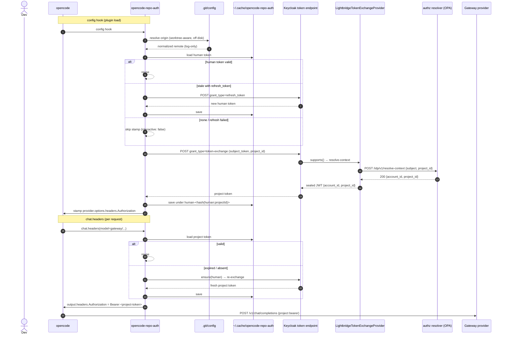
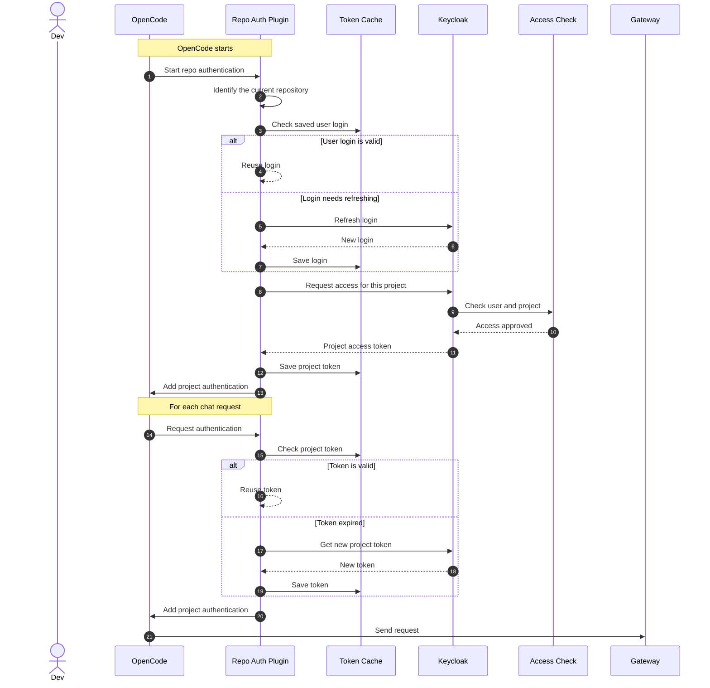

# `@vymalo/opencode-repo-auth`

Status: **implemented** (issue [#67](https://github.com/ADORSYS-GIS/lightbridge-opencode-toolbeit/issues/67)) — see [ADR-0011](adr/0011-repo-auth-project-id-token-exchange.md) (Accepted) and `packages/opencode-repo-auth/`.

Goal, in one line: **give local-dev OpenCode requests the repo-as-principal attribution CI already has** — a developer authenticates once as themselves, and every gateway request from an *enrolled* repo carries a project-scoped bearer, so Authorino bills and access-controls the request to the repo's project instead of the developer's person.

This is the client half of epic [#64](https://github.com/ADORSYS-GIS/lightbridge-opencode-toolbeit/issues/64). It builds on `@vymalo/opencode-auth-core` (extracted in [#66](https://github.com/ADORSYS-GIS/lightbridge-opencode-toolbeit/pull/97)) and reuses its security-critical OAuth machinery — **no forked token code**.

## What this plugin does

On an enrolled repo (one whose `opencode.json` declares a `projectId` on a provider), the plugin:

1. **Resolves the repo's git identity** — worktree-aware, credentials stripped — for logging and repo correlation (v1 derives nothing from it; see [Out of scope / deferred](#out-of-scope--deferred)).
2. **Ensures the developer's human token** via `auth-core`'s `TokenRuntime` (`device_code` / `authorization_code`, `offline_access`), cached per human.
3. **Exchanges it once per project** — a single RFC 8693 token exchange presenting `project_id` as a form param — and caches the SPI-sealed project token per project (`human-<hash(human:projectId)>.json`, OS cache dir, `0o600`, atomic rename, NTFS-safe key).
4. **Injects `Authorization: Bearer <project-token>`** on the *gateway provider only* (guarded by managed provider id), both at config time (the config-object handshake for `@vymalo/opencode-models-info`) and per request (`chat.headers`).

It **no-ops** (never crashes, never touches other providers) when: the repo has no `origin` remote, the provider has no `options.meta.repoAuth` block, the block has no `projectId`, or the provider is already managed by `@vymalo/opencode-oauth2`.

## The contract it implements — and why the ticket body is superseded

The ticket body describes the original design: resolve git `origin` → Source id → exchange the human token to `aud = <base>/sources/src-XXX`. **That design is dead.** Two comments on [#67](https://github.com/ADORSYS-GIS/lightbridge-opencode-toolbeit/issues/67) reframed it, and the IdP side has since shipped the final shape:

| Revision | Flow | Status |
| --- | --- | --- |
| Ticket body | git remote → Source id → exchange to `aud=/sources/src-XXX` | **Superseded** |
| Comment 1 (2026-07-07) | mint `request_id` via authz `POST /api/v1/idp/requests` → exchange with `request_id` | **Superseded** (SPI simplified) |
| Comment 2 (2026-07-07) — **authoritative** | **single Keycloak token exchange** presenting `project_id` form param; SPI seals `{account_id, project_id}` | **Live** — confirmed by [`lightbridge-keycloak-spi` architecture](https://github.com/ADORSYS-GIS/lightbridge-keycloak-spi/blob/main/docs/architecture.md) |

Consequences for the plugin:

- **No `aud=Source`, no mint step, no client-side resolve call.** The `project_id` is **declared** in `opencode.json` (`options.meta.repoAuth.projectId`) — a repo may belong to many projects, so it is never derived from the remote. The SPI's backend resolver (`lightbridge-authz` `POST /idp/v1/resolve-context`) does the membership check server-side.
- **Cache is keyed by `project_id`** (hashed), not by Source.
- The ticket's "resolve-by-remote" stays deferred (see [Out of scope / deferred](#out-of-scope--deferred)); the git module in v1 exists for repo identity/logging and worktree correctness.

## The exchange contract (from `lightbridge-keycloak-spi`)

The plugin must produce exactly this request at the Keycloak token endpoint:

```
POST <tokenEndpoint>
Content-Type: application/x-www-form-urlencoded

grant_type=urn:ietf:params:oauth:grant-type:token-exchange
client_id=opencode-cli
subject_token=<human JWT>
subject_token_type=urn:ietf:params:oauth:token-type:jwt
project_id=<declared project id>
```

- **No `audience` param.** The SPI rejects a self-audience ("Requested audience not available") — this is why `auth-core`'s existing `exchangeToAudience` cannot be used as-is (see [The auth-core gap](#the-auth-core-gap--key-decision)).
- The SPI (`LightbridgeTokenExchangeProvider`, order 100) claims the request when `project_id` is present, calls the authz resolver with `{subject, project_id}`, and on success returns a JWT sealed with `{account_id, project_id}` claims (`aud` = the requesting client). On **non-membership / unknown project / resolver error it fails closed — no token**.
- Without `project_id`, Keycloak's built-in `StandardTokenExchangeProvider` handles the exchange unchanged — the plugin never sends a bare exchange.

## Plugin behavior

### Config-time (`Hooks.config`) — plugin load

Mirrors `@vymalo/opencode-oauth2`'s config hook ([`opencode.ts`](../packages/opencode-oauth2/src/opencode.ts:612)) and `@vymalo/opencode-models-info`'s `options.meta` opt-in ([`config.ts`](../packages/opencode-models-info/src/config.ts:74)):

1. **Resolve repo identity** (worktree-aware, read off disk — see [git.ts](#package-layout)) → normalized `origin` remote. Emits `repo_auth_remote_resolved` (redacted) or `repo_auth_remote_missing`. Log-only in v1.
2. **Walk `config.provider`**; a provider opts in via `options.meta.repoAuth`. Parse + validate the block (see [Config shape](#config-shape)). Providers without it are skipped (`repo_auth_provider_skipped`).
3. **oauth2-conflict guard:** if the same provider also carries `options.oauth2` / `options.oauth2ModelSync`, skip it with `repo_auth_skipped_oauth2_provider` (warn). The two plugins must never manage the same provider — documented + guarded.
4. **Build the runtime** over `auth-core`: one `TokenRuntime` keyed by the human identity, `cacheDir = <cacheRoot>/opencode-repo-auth` (own on-disk location, per the ticket's namespace requirement — same pattern oauth2 uses to keep `<root>/opencode-oauth2`).
5. **Refresh-only warmup** (mirrors oauth2's `propagateCachedBearer`, [`opencode.ts:482`](../packages/opencode-oauth2/src/opencode.ts:482)): `ensure(human, { interactive: false })` → `exchangeTo(projectId, humanToken, { project_id })`. If a fresh interactive login would be required, skip the stamp (`repo_auth_bearer_propagation_skipped_no_token`) — never block startup on a browser/device prompt.
6. **Stamp `provider.options.headers.Authorization`** with the project bearer — unless the user already set an `Authorization` header (case-insensitive), which always wins. This is the config-object handshake that lets `@vymalo/opencode-models-info` fetch an OAuth2-protected `meta.modelsInfoUrl`. A stale value here is harmless: `chat.headers` overwrites per request.
7. **Rebuild on config-signature change** (OpenCode re-runs `config` on config edits) — mirror oauth2's `runtimeSignature` pattern ([`opencode.ts:458`](../packages/opencode-oauth2/src/opencode.ts:458)).

### Per-request (`chat.headers`)

1. Resolve provider id: `input.model?.providerID ?? input.provider?.info?.id` (same fallback as oauth2, [`opencode.ts:705`](../packages/opencode-oauth2/src/opencode.ts:705)).
2. **Managed-provider guard:** not a `repoAuth` provider → return untouched.
3. `ensure(human)` (interactive allowed here — first request may trigger the device-code/browser flow).
4. Read the cached project token for `projectId` (`human-<hash(human:projectId)>.json`):
   - valid → inject;
   - expired / absent → **re-exchange from the offline root** ("model b") → cache → inject.
5. **Fail closed:** an exchange failure (non-member, resolver error, network) produces **no header** — the gateway 401s, which is the correct behavior (matches the SPI's fail-closed semantics). Emits `repo_auth_exchange_failed` at error.

The project token is **never refreshed** — exchanged tokens carry no refresh token and re-exchange is the canonical renewal (epic risk mitigation: "Exchange `aud` not preserved across refresh → default to re-exchange from the offline root"). The human root token *is* refreshed via its `offline_access` refresh token.

### No-op matrix

| Condition | Behavior |
| --- | --- |
| No `origin` remote / not a git repo | `repo_auth_remote_missing`; plugin still works if `projectId` is declared (remote is log-only) |
| Provider without `options.meta.repoAuth` | skipped, untouched |
| `options.meta.repoAuth` without `projectId` | `repo_auth_skipped_no_project_id` (warn); no crash |
| Provider also managed by oauth2 | `repo_auth_skipped_oauth2_provider` (warn); skipped |
| Human token needs fresh interactive login at config time | stamp skipped (`..._skipped_no_token`); first `chat.headers` does it |
| Exchange fails (non-member / resolver error) | no header; `repo_auth_exchange_failed`; gateway 401s (fail closed) |

## Concrete walkthrough (Alice, `acme/webapp`, `proj-123`)

The flow is two-phase — **boot** (config hook) and **per request** (`chat.headers`) — and involves **two tokens**. This section walks one concrete example end to end.

### The cast

| Thing | Value | Notes |
| --- | --- | --- |
| Developer | Alice | logs in once as herself |
| Repo | `acme/webapp` (checked out at `/home/alice/work/acme-webapp`, a linked worktree) | |
| Project | `proj-123` | declared in `opencode.json`, never derived |
| IdP | `https://idp.acme.com/realms/camer-digital` (Keycloak) | |
| Gateway | `https://gateway.acme.com/v1` | the only provider repo-auth manages |
| **Human token** | `eyJ…` (JWT) + refresh token | "who Alice is" — cached at `~/.cache/opencode-repo-auth/human.json` |
| **Project token** | `eyJ…` (JWT with `account_id` + `project_id` claims) | "Alice working on proj-123" — cached at `~/.cache/opencode-repo-auth/human:<hash>.json` |

`opencode.json` (the enrolled-repo config):

```jsonc
{
  "provider": {
    "gateway": {
      "options": {
        "baseURL": "https://gateway.acme.com/v1",
        "meta": {
          "repoAuth": {
            "projectId": "proj-123",
            "issuer": "https://idp.acme.com/realms/camer-digital",
            "clientId": "opencode-cli",
            "scopes": ["openid", "offline_access"],
            "authFlow": "device_code",
            "tokenEndpoint": "https://idp.acme.com/realms/camer-digital/protocol/openid-connect/token",
            "deviceAuthorizationEndpoint": "https://idp.acme.com/realms/camer-digital/protocol/openid-connect/auth/device"
          }
        }
      }
    }
  }
}
```

### Boot — what happens when opencode starts

1. opencode starts in the repo and loads plugins. repo-auth's `config` hook fires.
2. **Git identity (log-only):** the plugin reads `.git/config` (worktree-aware — `.git` is a *file* here pointing at the common dir) and finds `origin = git@github.com:acme/webapp.git`, normalizes it to `github.com/acme/webapp` (userinfo stripped, scp form normalized), logs `repo_auth_remote_resolved`. Nothing is derived from it in v1.
3. **Provider walk:** the plugin finds `gateway` carries `options.meta.repoAuth` → parses it → `projectId = "proj-123"` + the auth config. This is the only provider it will ever touch.
4. **Runtime:** one `TokenRuntime` (auth-core) keyed by the human identity, cache dir `~/.cache/opencode-repo-auth/`.
5. **Warmup — human token, refresh-only** (`ensure(human, { interactive: false })`):
   - First run: no cached token → the runtime refuses to start a device-code prompt at boot → the plugin skips the stamp and logs `repo_auth_bearer_propagation_skipped_no_token`. Boot continues; the login happens on the first request instead.
   - Cached + valid: reused.
   - Cached + expired with refresh token: one `POST grant_type=refresh_token` to the token endpoint → new human token → saved.
6. **Exchange — project token** (only if step 5 produced a human token). One POST to the token endpoint:

   ```
   POST https://idp.acme.com/realms/camer-digital/protocol/openid-connect/token
   Content-Type: application/x-www-form-urlencoded

   grant_type=urn:ietf:params:oauth:grant-type:token-exchange
   client_id=opencode-cli
   subject_token=eyJ…            ← Alice's human token
   subject_token_type=urn:ietf:params:oauth:token-type:jwt
   project_id=proj-123
   ```

   Keycloak's SPI checks Alice's membership of `proj-123` via the authz resolver; on success it returns a JWT sealed with `{account_id: "acc-42", project_id: "proj-123"}`. The plugin saves it under `human:<hash(proj-123)>.json`.
7. **Config-object handshake:** the plugin stamps `provider.gateway.options.headers.Authorization = "Bearer <project token>"` so `@vymalo/opencode-models-info` (which runs after) can fetch an OAuth2-protected `meta.modelsInfoUrl`. A user-set `Authorization` still wins.
8. Boot is done. Nothing was sent to the gateway.

### A chat request — what happens when Alice sends a message

1. Alice types a message; opencode resolves the model to provider `gateway` and calls repo-auth's `chat.headers` hook.
2. **Guard:** `gateway` is a managed provider (has `options.meta.repoAuth`) → proceed. Any other provider → return untouched.
3. **Human token** (`ensure(human)`, interactive allowed): if Alice never logged in, this is where the device-code flow runs — the plugin prints "open https://idp.acme.com/device and enter ABC-DEFG" in the terminal, Alice completes it in her browser, the plugin polls and stores the human token + refresh token. If she has one, it's reused/refreshed silently.
4. **Project token:** read `<cacheDir>/human-<hash(human:proj-123)>.json`:
   - still valid → use it;
   - expired or absent → re-run the exchange POST from step 6 (no user interaction — the human refresh token makes it automatic) → save → use it.
5. **Inject:** `output.headers.Authorization = "Bearer <project token>"`.
6. opencode sends `POST https://gateway.acme.com/v1/chat/completions` with that header. Authorino validates the JWT, reads `account_id`/`project_id`, and bills the request to the project.

### The token timeline (why two tokens, what "model b" means)

- The **human token** only says "Alice". It is never sent to the gateway.
- The **project token** says "Alice working on proj-123" — that is what the gateway/Authorino accepts and bills. It is short-lived (Keycloak exchange tokens are typically minutes) and has **no refresh token**.
- **"Model b"** is the renewal rule: never try to refresh the project token (a refresh would lose the project claims — the epic's "exchange `aud` not preserved across refresh" risk). Instead, when it expires, re-do the exchange from the **offline root** — the human token, which *does* have a refresh token and can renew itself without any user interaction. So after the one-time login, every subsequent renewal is automatic: human refresh (1 POST) → re-exchange (1 POST) → inject.

```
login (once, interactive) → human token + refresh token
        │
        ▼
exchange (per project, on demand) → project token {account_id, project_id}
        │
        ▼
chat request → inject project token on the gateway provider only
        │
        └─ project token expired? → re-exchange from the human token (automatic)
```

### Human token vs project token

| | **Human token** | **Project token** |
| --- | --- | --- |
| **What it says** | "Alice is logged in" | "Alice is logged in **and is working on project `proj-123`**" |
| **Claims it carries** | `sub` (Alice's user id), `iss`, `aud = opencode-cli`, scopes | `sub` + **`account_id`** + **`project_id`** (sealed by the SPI) |
| **Who issues it** | Keycloak directly, when Alice completes the device-code login | Keycloak's **SPI**, during the token exchange (human token + `project_id` → membership check → sealed JWT) |
| **How it's obtained** | One-time interactive login (device code in the terminal) | On demand, automatically — one POST, no user interaction |
| **Renewal** | Has a **refresh token** (`offline_access` scope) → renews itself silently | **No refresh token** → when it expires, re-do the exchange ("model b") |
| **Lifetime** | Longer (Keycloak access token, refreshable) | Short (typically minutes) |
| **Who consumes it** | Only the plugin itself — as the `subject_token` in the exchange | The **gateway** — as `Authorization: Bearer` on every chat request |
| **Where it's cached** | `~/.cache/opencode-repo-auth/human.json` | `~/.cache/opencode-repo-auth/human-<hash>("human:<proj-123>").json` (identity-prefixed `-`, hashed over the `identity:key` pair — no `:` in filenames, so the layout is NTFS-safe; separate human identities can never collide on the same project key) |
| **If it leaks** | Attacker can impersonate Alice — exchange it for project tokens of **any** project she belongs to. This is the master credential. | Attacker can make gateway requests billed to **one project**, for a few minutes, until it expires. Bounded blast radius. |

> **If a project token was revoked but its cached copy hasn't expired yet**, the gateway will keep returning `401` until the TTL elapses — the exchange only re-runs on expiry, and the plugin cannot observe 401s (it has no post-response hook). The project token is bound to a short TTL by design, so this self-heals within minutes. To force it now, delete the cached file (`<cacheDir>/human-<hash>.json`) — the next request re-exchanges from the human root. `repo-auth reset` (see [Caching and reset](#caching-and-reset)) clears the human root and every exchanged token at once.

The human token is the **offline root** (the thing that can renew itself); the project token is the **leaf credential** (what actually touches the gateway). The gateway never sees the human token; the human token never carries project context.

### Failure modes, concretely

- Alice is **not a member** of `proj-123` (or the project doesn't exist): the SPI returns 404, the exchange fails, the plugin injects **no header**, and the gateway 401s. Fail closed — the request never runs under a wrong identity.
- The gateway provider is also managed by `@vymalo/opencode-oauth2`: the plugin skips it with `repo_auth_skipped_oauth2_provider` — the two plugins never fight over one provider.
- No `projectId` in the meta block: the provider is skipped, nothing crashes.

## Architecture

### Package layout

Mirrors the per-package convention (see `AGENTS.md`), **minus `cache.ts`** (auth-core's `FileCacheStore` via `TokenRuntime` owns persistence) and **plus `git.ts`**:

```
packages/opencode-repo-auth/
├── src/
│   ├── index.ts        # slim entry — single `export { default } from "./opencode.js"`
│   ├── opencode.ts     # plugin factory: createOpencodeRepoAuthPlugin(opts) → Plugin; hooks
│   ├── plugin.ts       # RepoAuthPlugin runtime — testable core (ensure/exchange/inject)
│   ├── config.ts       # options.meta.repoAuth parsing + validation → AuthServerConfigInput + projectId
│   ├── git.ts          # worktree-aware repo-root + origin-remote resolution, remote normalization
│   └── lib.ts          # public API (embedders): createOpencodeRepoAuthPlugin, RepoAuthPlugin, git utils
└── test/               # vitest, *.test.ts
```

- **No `cache.ts`** — token persistence is auth-core's `FileCacheStore` (atomic rename, `0o600`, ADR-0005), reached through `TokenRuntime`. The plugin keeps only in-memory runtime state (managed provider ids, runtime signature).
- **Logging** comes from `auth-core`'s `logging.ts` (field-name redaction, `scrubSecrets`, `redactUrl`) — same primitives oauth2 uses.
- **`git.ts` reads off disk** (`.git/config`, worktree-aware) rather than shelling out to `git` — the house precedent set by otel's VCS collector (CHANGELOG 0.14.0: read `.git/config`/`HEAD`/`refs` directly; no subprocess, no `git` on `PATH`). For a linked worktree `.git` is a *file* containing `gitdir:` — resolve the common dir, then read `[remote "origin"] url` from the common dir's config. `normalizeRemote` strips `user:pass@` userinfo, normalizes scp-style (`git@host:org/repo.git`) and https forms, drops query/fragment. Trade-off accepted: raw config misses `url.<base>.insteadOf` rewrites that `git remote get-url` would apply — irrelevant in v1 because the remote is log-only; revisit if resolve-by-remote lands.

### Config shape

Per-provider opt-in via `options.meta.repoAuth`, mirroring models-info's `options.meta.modelsInfoUrl` pattern. The auth-server fields ride in the same block (like oauth2's per-provider `options.oauth2` shape) so each managed provider is self-contained:

```jsonc
{
  "provider": {
    "gateway": {
      "npm": "@ai-sdk/openai-compatible",
      "options": {
        "baseURL": "https://gateway.example.com/v1",
        "meta": {
          "repoAuth": {
            "projectId": "proj-123",
            "issuer": "https://idp.example.com/realms/camer-digital",
            "clientId": "opencode-cli",
            "scopes": ["openid", "offline_access"],
            "authFlow": "device_code",
            "tokenEndpoint": "https://idp.example.com/realms/camer-digital/protocol/openid-connect/token",
            "deviceAuthorizationEndpoint": "https://idp.example.com/realms/camer-digital/protocol/openid-connect/auth/device"
          }
        }
      }
    }
  }
}
```

- `projectId` is required; everything else maps onto `AuthServerConfigInput` (auth-core) — explicit endpoints optional, OIDC discovery fills the gaps (auth-core's `resolveEndpoints`).
- `authFlow` defaults to `authorization_code` (auth-core's `DEFAULT_AUTH_FLOW`); `device_code` is the recommended interactive flow for a CLI.
- `scopes` must include `offline_access` so the human root gets a refresh token (the "offline root" that model-b re-exchange depends on).
- Alternative considered: a shared top-level `pluginConfig.repoAuth` for the IdP config with only `projectId` per provider. Rejected for v1 — the ticket's stated shape is per-provider meta, the suite's opt-in convention is per-provider meta, and the "one gateway provider" case is the norm. Revisit only if multi-provider duplication becomes real.

### Runtime composition over auth-core

- **One `TokenRuntime` per distinct `AuthServerConfig`** (v1: one — a single Keycloak realm). The runtime is identity-keyed; the identity is the **human** (`"human"` constant — the plugin is single-IdP in v1; if multi-IdP ever lands, derive `issuer|clientId`).
- **Human root token**: `ensure()` / `refresh()` — cached at `<cacheDir>/human.json`.
- **Project token**: `exchangeTo(projectId, subjectToken, { project_id })` — cached at `<cacheDir>/human-<hash("human:"+projectId)>.json`.
- **Key derivation** is `auth-core`'s `exchangeCacheKey` — `${identity}-${hashCacheKey(`${identity}:${key}`)}`: a deterministic truncated `sha256` hex of the **`identity:key` pair** (the `/`-separator was replaced by `-` and the full pair is hashed, so the filename is NTFS-safe — no `:` — and two identities exchanging for the same project can never collide). It is a cache-key derivation from an upstream id, not a minted record id — the CUID2 rule does not apply. `FileCacheStore` uses keys verbatim as filenames ([`cache.ts:36`](../packages/opencode-auth-core/src/cache.ts)).
- **Reset / log-out** (`repo_auth_reset`): removes `human.json` **and** every `human-*` exchanged token — `TokenRuntime.reset` now walks the cache dir via `listKeys(`${identity}-`)` and deletes each ([`token-runtime.ts`](../packages/opencode-auth-core/src/token-runtime.ts)). A bad day can be undone with `rm -rf <cacheDir>`, but the API no longer leaves orphaned project tokens behind a cleared human root.
- **`cacheDir`**: `join(resolveCacheRoot(), "opencode-repo-auth")` — the ticket's namespace, and the pattern `resolveCacheRoot` exists for (oauth2 keeps `<root>/opencode-oauth2`; auth-core's default `opencode-auth-core/` is not used here).

### The auth-core gap (key decision)

`auth-core`'s only exchange primitive is `exchangeToAudience(audience, subjectToken)` ([`token-runtime.ts:87`](../packages/opencode-auth-core/src/token-runtime.ts)), which POSTs an `audience` form param — **exactly what the SPI rejects**. The plugin needs a `project_id` form param. Options:

| Option | Description | Verdict |
| --- | --- | --- |
| **A — extend auth-core (recommended)** | Generalize the federated-grant machinery: `OAuthClient.exchange({ subjectToken, extraParams })` + `TokenRuntime.exchangeTo(key, subjectToken, extraParams)`, cached under an identity-prefixed hash of the `identity:key` pair (`identity-<hash(identity:key)>`, NTFS-safe). `exchangeToAudience` stays a compatibility wrapper (`exchangeTo(audience, subjectToken, { audience })`). repo-auth calls `exchangeTo(projectId, humanToken, { project_id: projectId })`. | **Adopt.** Keeps the security-critical code (timeout, scrubbing, redaction, PKCE-free machine grant) in the one place #66 exists to create. Generic, not SPI-shaped — auth-core stays model-free. |
| B — plugin does its own HTTP POST | Duplicate the token-endpoint call in repo-auth. | **Reject.** Re-creates the exact drift #66 was filed to eliminate (timeout/scrub/redact bugs land in two places). |
| C — pass `projectId` as `audience` | No auth-core change. | **Reject.** The SPI explicitly rejects a self-audience; the exchange would fail closed every time. |

The extension is small and backward-compatible; it can ride in the repo-auth PR (auth-core is still under review in #97) or land as a tiny auth-core PR first — one PR per concern suggests the latter if #97 merges first.

> **Review note for #97 (resolved in the review round):** `TokenRuntime.exchangeToAudience` caches under a derived key and `FileCacheStore` uses keys verbatim as filenames — a URL-shaped key (`https://…/sources/src-1`) would be path-unsafe on Windows (`:`) and would create nested dirs on POSIX (`/`). The generic `exchangeTo` now derives its key as `identity-<hash(identity:key)>` ([`token-runtime.ts`](../packages/opencode-auth-core/src/token-runtime.ts) `exchangeCacheKey`), which eliminates both classes of problem for every caller, repo-auth included.

### Token lifecycle ("model b")

```
project token valid? ──yes──▶ inject cached
        │ no (expired / absent / no expires_in)
        ▼
ensure(human)   ← refreshes the offline root via its refresh_token if stale
        ▼
exchangeTo(projectId, humanToken, { project_id })
        ▼
cache + inject
```

- The project token's `expiresAt` comes from the exchange response's `expires_in`. **Undefined expiry → treat as expired** (re-exchange each time) — matching auth-core's machine-flow policy ([`client.ts:76`](../packages/opencode-auth-core/src/oauth/client.ts)) and the ticket's "short TTL" intent.
- Validity check applies the standard `tokenExpirySkewMs` (default 30s) headroom.
- No scheduler: the project token is only consumed when a request runs; proactive re-exchange gains nothing and costs a round trip. Lazy re-exchange on `chat.headers` is the whole lifecycle.

### Events (snake_case, house pattern)

| Event | When | Level |
| --- | --- | --- |
| `repo_auth_config_hook_start` / `_finished` | config hook entry/exit | trace |
| `repo_auth_remote_resolved` / `repo_auth_remote_missing` | git identity resolution | debug / trace |
| `repo_auth_provider_opted_in` / `repo_auth_provider_skipped` | provider walk | trace |
| `repo_auth_skipped_no_project_id` | meta block without `projectId` | warn |
| `repo_auth_skipped_malformed` | unparseable `meta.repoAuth` (other providers still managed) | warn |
| `repo_auth_skipped_oauth2_provider` | oauth2-conflict guard | warn |
| `repo_auth_skipped_invalid_auth` | `RepoAuthPlugin` construction failed (invalid auth config) | warn |
| `repo_auth_human_token_ensured` | `ensure(human)` result | debug |
| `repo_auth_exchange_started` / `_success` / `_failed` | token exchange | info / info / error |
| `repo_auth_exchange_cache_hit` / `_miss` | project-token cache read | trace |
| `repo_auth_bearer_propagated_to_provider_headers` / `..._skipped_user_set` / `..._skipped_no_token` | config-time stamp | debug |
| `repo_auth_chat_headers_bearer_injected` / `repo_auth_chat_headers_skipped` | per-request injection | trace |

Happy-path lifecycle events sit at `debug`/`trace` (silent at default `info`), failures at `warn`/`error` — same convention as oauth2.

### Sequence


# minimal version


## Security posture

- **Managed-provider guard** — the project bearer is only ever stamped/injected on providers carrying `options.meta.repoAuth`. No repo/project identity leaks to other providers (the ticket's "leaking repo URL to non-gateway providers" risk).
- **oauth2-conflict guard** — never both plugins on one provider; skip + warn, never crash.
- **Redaction** — auth-core's logger redacts `token|secret|password` fields; `scrubSecrets` masks token-shaped substrings in error bodies; `redactUrl` strips userinfo/query from logged endpoints. The normalized remote has userinfo stripped before it is ever logged.
- **Disk** — `0o600` files, atomic rename, `0o700` dirs (auth-core `FileCacheStore`, ADR-0005).
- **Fail closed** — exchange failure ⇒ no header ⇒ gateway 401. The plugin never invents a token.
- **No content capture** — the plugin only reads/writes headers and the token cache; it never sees prompts or responses.

## Composition contract

- **Ordering in `plugin`:** `repo-auth` → `models-info` → `ratelimit`. repo-auth stamps `provider.options.headers.Authorization` at config time so models-info's `meta.modelsInfoUrl` fetch inherits the project bearer; ratelimit's fetch wrapping is auth-independent so its position is cosmetic (same contract as oauth2 → models-info → ratelimit today).
- **Never on the same provider as `@vymalo/opencode-oauth2`** — documented + guarded (see [No-op matrix](#no-op-matrix)). A dev may run both plugins on *different* providers (oauth2 for one IdP, repo-auth for the gateway); they share nothing — separate cache namespaces, separate runtimes.
- **`chat.headers` "after any user-bearer"** (ticket wording) is interpreted as: on a managed provider, the project bearer **wins** per request (it is the more specific credential and the gateway requires it); at config time a user-set `Authorization` still wins (mirror oauth2). Flag for confirmation with the owner.

## Testing

- **Unit** (`test/*.test.ts`, vitest):
  - `git.ts`: scp vs https normalization, `user:pass@` stripping, query/fragment drop, linked-worktree `.git` file resolution, missing remote.
  - `config.ts`: opt-in parsing, missing `projectId`, oauth2-conflict detection, `AuthServerConfigInput` mapping.
  - `plugin.ts`: cache keying (`identity-<hash(identity:key)>` deterministic, NTFS-safe), exchange request shape (asserts `project_id` form param present, no `audience`), model-b re-exchange on expiry, in-flight exchange dedup, no-op matrix, reset clears human + project tokens, fail-closed on exchange error.
- **Integration** (Keycloak stub — extend the `test-env` WireMock stack; the oauth2 Keycloak stub is already sketched there): exchange carries `project_id`; sealed token lands in the injected header; non-member → 404 → no header.
- **Manual e2e** against the real gateway: enrolled repo + logged-in dev → gateway sees the project bearer; unenrolled repo → no header.

## Out of scope / deferred

- **resolve-by-remote** (derive `projectId` from the remote) — deferred; the git module is built to support it later.
- **Monorepo sub-project Sources** — one project per repo in v1.
- **Self-serve Source claiming** — stays operator-controlled (ADR-0049).
- **`auth-core` extraction** — done in #66 (PR #97).
- **`opencode-core` kit** unifying logging/cache/config across all plugins — separate refactor.

## Decisions to confirm + ADR candidates

1. **`project_id` form-param exchange vs the ticket body's `aud=Source`** — the design follows the superseding comments + the live SPI contract. Worth an ADR (the ticket references `docs/adr/0005-…`; this decision closes off the audience-scoped design someone would reasonably reach for).
2. **auth-core generic exchange extension** (Option A) — small, backward-compatible; confirm whether it rides in the repo-auth PR or lands as a separate auth-core PR.
3. **Read-off-disk git vs `git` CLI** — off-disk matches otel's precedent; CLI would honor `insteadOf` rewrites. Log-only in v1, so off-disk wins.
4. **`chat.headers` "after any user-bearer" interpretation** — project bearer wins per request on managed providers.
5. **Config shape** — per-provider `options.meta.repoAuth` (recommended) vs shared top-level `pluginConfig.repoAuth`.